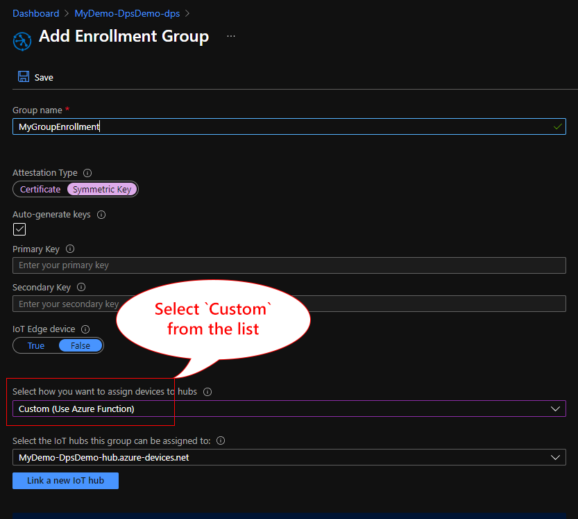

# Azure-DPS-Custom-Allocation

## 1. Deploy Azure resources with ARM template  

- IoT Hub
- Device Provisioning Service (DPS)
- Event Grid Topic and Subscription
- Azure Functions  
        - **dps_processor** : A Webhook function to receive and process when a device starts provisioning through DPS  
        - **eventgrid_processor** : Event Grid Subscriber to receive IoT Hub device lifecycle events
- Storage service and App Service for Azure Functions

Provide following parameters

| Field                 | Description                                    | Notes                                        |
|-----------------------|------------------------------------------------|----------------------------------------------|
| Subscription          | Select your subscription                       |                                              |
| Resource Group        | Create a new subscription                      |                                              |
| Region                | Select region for all resources                | E.g. West US 2                               |
| Resource Prefix       | Prefix is added to resources' names            |                                              |
| Unique ID             | Provide a unique ID.  5~12 characters          | Take default to use auto generated unique ID |
| IoT Hub SKU           | Pricing Tire of IoT Hub                        | Select F1 (Free) or S1 (Standard)            |
| Functions Repo URL    | URL of Functions source code Github Repo       | Take default or change this URL to your repo |
| Functions Repo Branch | Branch name of Functions source code to deploy |                                              |

> [!TIP]  
> Storage Service name is up to 24 characters.  Keep name of resource group and unique id less than 20 characters.  
> ARM template add `stor` to the end of name.

Resources are named in following way:

- \<Resource Group Name>-\<Unique ID>-hub
- \<Resource Group Name>-\<Unique ID>-dps-topic
- \<Resource Group Name>-\<Unique ID>-dps
- \<Resource Group Name>-\<Unique ID>-appsvc  
- \<Resource Group Name>\<Unique ID>stor  
  etc

## 2. Click `Reivew + create` to start deployment

### 3. Wait for the deployment to complete

The process takes about 7 minutes.

## 3. Create Enrollment

Open Azure CLI (Az CLI) command line or use Cloud Shell to run the script.

Select `Outputs` from left pane

You will find multiple outputs.

| Output                     | Description                                                                          | 
|----------------------------|--------------------------------------------------------------------------------------|
| UniqueId                   | Unique ID used for this deployment                                                   |
| DpsWebHookUrl              | Webhook URL for DPS's Custom Allocation                                              |
| iotDpsIdScope              | DPS ID Scope                                                                         |
| CreateGroupEnrollment      | AZ CLI command line to create a Group Enrollment **SampleGroupEnrollment**           |
| CreateIndividualEnrollment | AZ CLI command line to create a Individual Enrollment **SampleIndividualEnrollment** |

### Option 1: Run Az CLI in Cloud Shell

1. Start Cloud Shell by clicking button in the top bar

    This will start Cloud Shell using the bottom half of Browser window

    

    > [!NOTE]  
    > If this is the first time to use Cloud Shell, Azure Portal will prompt to create storage service.  
    >  
    > Learn more about Cloud shell storage. <https://docs.microsoft.com/en-us/azure/cloud-shell/persisting-shell-storage>

1. Copy and paste `createGroupEnrollment` from `outputs`

### Option 2: Run Az CLI on your computer

1. Follow the instruction [here](https://docs.microsoft.com/en-us/cli/azure/install-azure-cli) to install Az CLI
1. Copy and paste `createGroupEnrollment` from `outputs`

### Option 3: Manually create in Azrue Portal

1. Navigate to DPS instance.  E.g. MyDemo-DpsDemo-dps  

    > [!TIP]
    > You may browser from the link to your DPS instance in `Overview` window
    > 

1. Select `Manage Enrollments` in the left menu

    

1. Provide Registration ID, etc  

    See more on enrollment list [here](https://docs.microsoft.com/azure/iot-dps/how-to-manage-enrollments)

1. Select `Custom Allocation Policy`

    Select `Custom (Use Azure Function)` for `Select how you want to assign devices to hubs`  

    

1. Scroll down to `Select Azure Function` section

1. Select Subscription, Function App, and Function

    Make sure to select Function App created above (e.g. MyDemo-DpsDemo-functions).  
    Section `dps_processor` for `Function`

    

## 4. Configure your device

Configure your device with ID Scope, Symmetric Key, and Registration Id.

> [!TIP]  
> After creating enrollment(s), you can use symmetrick key from AZ CLI output and ID Scope from `outputs` to configure your devices
> 

## 5. Provision device

When a device is provisioned, following operations take place.

1. During DPS register operation, `dps_processor` function adds Tags and Desired Properties to device's Device Twin  

    - Tag : "TagFromDpsWebHook":"CustomAllocationSample"
    - Desired Properties  
        - "FromDpsWebHook1" : "InitialTwinByCustomAllocation"
        - "FromDpsWebHook2" : \<Registration ID of the enrollment list>
    - For Impinj R700, it sets "Hostname" Property to change deivce's host name using IoT Plug and Play Device Model (and Parser)  
        The hostname will be set to impinj-<YYYYMMDD>-<HHMMSS>

1. The device is authenticated and DPS creates Device Identity in IoT Hub

    DPS passes Desired Property values

1. IoT Hub creates a new Device Identity, and publishes `DeviceCreated` event to Event Grid

1. The `eventgrid_processor` function receives `DeviceConnected` event

    `eventgrid_processor` adds Device Twin tag `TagFromEventGrid` = "Processed"

1. The device initiates authentication and connection to the IoT Hub

1. The connection to IoT Hub is established 

    IoT Hub publishes `DeviceConnected` event to Event Grid.

1. The device receives Device Twin

1. The `eventgrid_processor` function receives `DeviceConnected` event

    - For Impinj device, it sends `Presets` command
    - For Seeed Wio Terminal, it sends `ringBuzzer` command

### Flow Chart

Summary of Device Provisioning flow ([PDF](https://github.com/daisukeiot/Azure-DPS-Custom-Allocation/blob/main/media/DPS-IoTHub-ProvisioningFlow.pdf))

